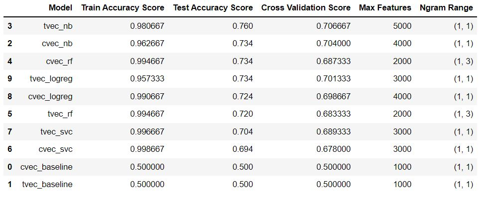
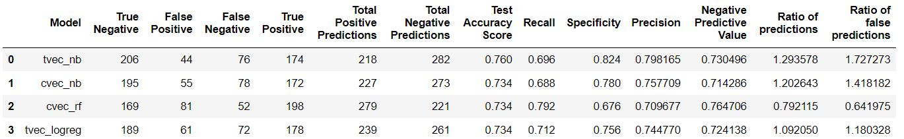
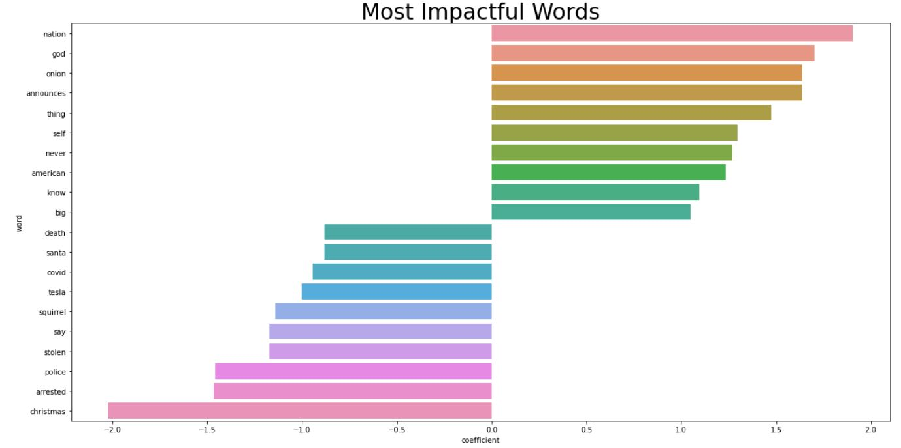

# Background
When performing maintenance, an engineer accidentally deleted multiple posts from r/nottheonion and r/theonion. Unfortunately, the engineer was only able to recover the titles of the lost posts. As the data science team of Reddit, we were therefore tasked to build a classification model which would train on posts submitted before 01 Jan 2022 to classify the recovered posts back to their respective subreddits, r/nottheonion and r/theonion, based solely on the post titles.

This model would also be used as a proof of concept for the development of an automated moderator which would automatically delete posts that do not belong to the subreddit that they are posted to. There has been an increase in bots spamming subreddits with irrelevant posts. Moderators have been spending a substantial amount of their time reviewing user reports and deleting spam posts from the subreddit. Having automated moderators police the subreddit for spam posts would free up time for human moderators, who are volunteers, to do things that they want to do.

# Problem Statement
Scrape the most recent 1,000 posts that were posted before 01 Jan 2022. Do this for each of the 2 subreddits to form a dataset of 2,000 posts.

Using the title texts of the posts, train a classification model to classify the posts into 1 of the 2 subreddits.

In combination with 2 types of vectorizers (Count Vectorizer and TFIDF Vectorizer), a total of 4 model types will be used (Logistic Regression, Multinomial Naive Bayes, Random Forest and Support Vector Machine). Hence, a total of 8 machine learning classification models will be trained and scored in addition to the baseline model.

Since the dataset is split nicely in half between posts from each subreddit, Accuracy score will be the key performance indicator. We want the Accuracy score to be high so that Redditors will be able to discuss the correct posts in their respective subreddits. Having the posts in the right subreddits is also an indicator of Reddit's quality of service. Secondly, we want a balanced model to reduce a similar amount of workload for human moderators of each subreddit.

# Data Dictionary

| Feature |	Description |
| --- | --- |
|title	|Title of reddit post	|
|author| Reddit username of the author of the post|
|domain| Domain of the website the post content is from|
|total_awards_received| Total number of awards that were awarded to the post by other Reddit users|
|num_comments| Number of comments on the Reddit post|
|upvote_ratio| Percentage of upvotes out of total votes (upvotes + downvotes)|
|over_18| Whether or not the post features adult content|
|removed_by_category| Explains why a post was removed. E.g. A moderator removed it |

# Methodology

1. Data scrapping using Pushshift API
2. Data Preprocessing using Lemmitization and Removal of stopwords
3. Exploratory Data Analysis
4. Vectorize title text data using Count Vectorizer (cvec) or TFIDF Vectorizer (tvec)
5. Data modeling using Multinomial Naive Bayes (nb), Random Forest (rf), Logistic Regression (logreg) and Support Vector Machine (svc) models (Each model was modeled twice, 1 with Count Vectorizer and 1 with TFIDF Vectorizer)
5. Scoring models 
6. Selecting the best performing model

# Key Findings
## Model Selection

- The models are named in the form of vectorizer_model. E.g. tvec_nb means TFIDF Vectorizer into Multinomial Naive Bayes.

**Insights**
- Baseline models have scores of 50% which is reflective of the dataset having 50% posts from each subreddit.
- Test Scores for all non-baseline models are very high, with all of them above 95%
- Between Count Vectorizer and TFIDF Vectorizer, TFIDF performed better for all non-baseline models except for the Random Forest model
- Except for the 2 Random Forest models, all other models performed the best with unigrams, i.e. Ngram Range = (1,1)

**Model Selection**
- As the dataset is balanced, i.e. split 50/50 between posts from The Onion and Not The Onion, Accuracy Score will be a good evaluation metric
- Since Train Scores are very high for all non-baseline models, it will not be an important factor when determining the best performing model

### Confusion Matrix Scores
- Shortlist the 3 models with the highest accuracy scores and dive deeper into the results using the Confusion Matrix
- As there are 3 models tied for 2nd place in terms of test score, to look at confusion matrix of top 4 models

### Interpreting the scores:
- Posts from The Onion are set as class 1 and posts from Not The Onion are set as class 0
- In this case, class 1 will be used as "positive" and class 0 as "negative"

There are 4 types of predictions:
- True Positive: Model predicts that post is from The Onion and post is from The Onion (correct prediction)
- True Negative: Model predicts that post is from Not The Onion and post is from Not The Onion (correct prediction)
- False Positive: Model predicts that post is from The Onion but post is from Not The Onion (wrong prediction)
- False Negative: Model predicts that post is from Not The Onion but post is from The Onion (wrong prediction)

**Interpreting the scores:**
- Accuracy Score: Out of all posts, how many % of the model's predictions were correct?
- Recall Score: Out of all the The Onion posts, how many % of the model's The Onion predictions were correct?
- Specificity Score: Out of all the Not The Onion posts, how many % of the model's Not The Onion predictions were correct?
- Precision Score: Out of all the The Onion predictions, how many % were correct?
- Negative Predictive Value: Out of all the Not The Onion predictions, how many % were correct?

**Insights:**
- The model with the highest Test Accuracy Score is tvec_nb
- Even though there are 3 models with the same Accuracy Score, their scores in the other categories are not the same
- cvec_rf has the highest Recall score, getting 79.2% of all The Onion posts correct. However, this is achieved by a disproportionate number of The Onion predictions (279 out of 500) and the lowest Precision score at 71%. In other words, cvec_rf predicted a high number of posts as The Onion and even though it got the highest number of The Onion predictions correct, the Accuracy Score for each The Onion prediction is low.
- tvec_nb did the same, but for Not The Onion posts. It has the highest Specificity score, getting 82.4% of all the Not The Onion posts correct. This was also achieved by a disproportionate number of Not The Onion predictions (282 out of 500). However, its Negative Predictive Value is actually the second highest at 73%. This contributes to explaining why this model has the highest Test Accuracy Score.

**Choosing the best model:**
- As the data science team of Reddit, we should be impartial towards moderators of each subreddit.
- To be fair to the subreddits, we want to pick a model that is ideally equally accurate at predicting for either subreddit
- Given that this is the 1st iteration of the automoderator, the human moderators probably do not expect the predictions to be perfect, so we want to pick the model with the more balanced predictions (i.e. ratio of total negative predictions to total positive predictions to be close to 1.0, "Ratio of predictions" in table)
- The aim of the automoderator is to classify posts correctly so the human moderators can get more work taken off them. Conversely, predicting a post wrongly will result in more work for the human moderators and we want to spread this evenly across the 2 subreddits (i.e. ratio of false negatives to false positives to be close to 1.0, "Ratio of false predictions" in table)

**Most balanced model:**
- tvec_logreg is selected as the most balanced model as it has the closest ratios to the ideal 1.0

**Additional Advantage:**
- A Logistic Regression model is not a blackbox model so we are able to look at the high impact words that affect the classification

**Observation:**
- The words with positive coefficients are the 10 most impactful in classifying a post into The Onion
- Impactful words for The Onion: nation, god, onion, announces, thing, self, never, american, know, big
- Conversely, words with negative coefficients are the 10 most impactful in classying a post into Not The Onion
- Impactful words for Not The Onion: death, santa, covid, tesla, squirrel, say, stolen, police, arrested, christmas

# Conclusion and Recommendations

**Best model for our requirements:**
- tvec_logreg is selected as the best model based on our evaluation metrics
- Even though it only has the second highest Test Accuracy Score, we are sacrificing a little bit of that to ensure more balanced predictions 
- The reduction of workload for human moderators in both subreddits will be more balanced and this will reflect well on us as we are being impartial 
- Additionally, a Logistic Regression model is not a blackbox model. Hence, we are able to identify high impact words that affect the classification

**Limitations:**
- The model is trained using posts from just before 1st January 2022, hence it may be skewed towards news topics that were popular during that time
- The model will not be able to account for changes in posting behavior should subreddit rules change drastically after 1st January 2022

**Future Improvements:**
- Scrape a larger number of posts to train the model
- In addition to just the title text, include other metadata from Reddit to train the model (e.g. author posting behavior, number of comments etc.)

----
# References

1. [Kenosha Unrest Shooting][1]
2. [Let's Go Brandon][2]
3. [Florida Man][3]
4. [Nissan Recall][4]

[1]: https://en.wikipedia.org/wiki/Kenosha_unrest_shooting "Title"
[2]: https://en.wikipedia.org/wiki/Let%27s_Go_Brandon "Title"
[3]: https://en.wikipedia.org/wiki/Florida_Man "Title"
[4]: https://www.cnet.com/roadshow/news/nissan-sentra-recall-sedans-brake-lights/ "Title"
